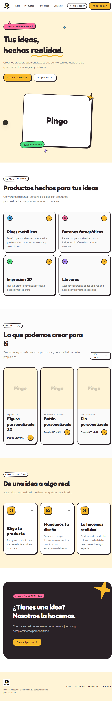

# Pingo POP

Web de pedidos personalised (pines, chapas, llaveros, impresión 3D): catálogo
público, carrito de cotización y panel de administración con subida de imágenes.



Repositorio: [`github.com/davidBroBa/Pingo-pop`](https://github.com/davidBroBa/Pingo-pop) — público, rama `main`. Historial en [`CHANGELOG.md`](CHANGELOG.md).

## Índice

- [Stack](#stack)
- [Puesta en marcha](#puesta-en-marcha)
- [Variables de entorno](#variables-de-entorno)
- [Scripts](#scripts)
- [Gates: qué pasa antes de entregar](#gates-qué-pasa-antes-de-entregar)
- [Estructura](#estructura)
- [Rutas](#rutas)
- [Modelo de seguridad](#modelo-de-seguridad)
- [Diseño y paleta](#diseño-y-paleta)
- [Despliegue](#despliegue)
- [Documentación](#documentación)
- [Límites conocidos](#límites-conocidos)

## Stack

| Pieza | Versión instalada | Nota |
|---|---|---|
| Next.js (App Router) | 16.3.8 | Server Components por defecto; `middleware` protege `/admin/*` |
| React | 19.2.4 | |
| TypeScript | 5.9.3 | `strict`. Prohibido `any`, `@ts-ignore` y `!` sin justificación |
| Tailwind CSS | 4.3.3 | `@theme inline` en `globals.css`; sin `tailwind.config.js` |
| Prisma CLI / cliente | 7.10.0 / 7.9.1 | El cliente se usa con `@prisma/adapter-mariadb` (7.10.0) |
| Driver de base de datos | `mariadb` 3.5.3 | La app **no** usa `mysql2`: entra solo como dependencia del CLI de Prisma (para las migraciones) y está fijada por `overrides` |
| Base de datos | MariaDB 11 / MySQL 8 | Docker en local, servicio propio en el servidor |
| Zod | 4.6.5 | Validación en el borde de toda entrada externa |
| argon2 | 0.45.1 | Hash de contraseñas (argon2id) |
| Tests | `node:test` + `tsx` 4.23 | 77 suites, 419 pruebas, **sin framework adicional** |

Node: **20.9 o superior** (lo exige Next 16). `package.json` no declara `engines`, así
que npm no te avisará si usas una versión antigua: compruébalo tú (`node -v`).

No hay CSS-in-JS, ni librería de componentes, ni cliente de datos: lo mínimo.

## Puesta en marcha

Requisitos: **Node 20.9+** (ver la nota de la tabla de Stack) y MariaDB o MySQL — la
forma más fácil es Docker.

```bash
# 1) Dependencias
npm install

# 2) Variables: copia la plantilla y rellena los valores
cp .env.example .env        # Windows PowerShell: Copy-Item .env.example .env

# 3) Base de datos en Docker (opcional si ya tienes una)
docker compose up -d

# 4) Migraciones + administrador inicial
npx prisma migrate deploy
npm run db:seed

# 5) Desarrollo
npm run dev                  # http://localhost:3000
```

`npm run db:seed` exige `ADMIN_EMAIL` y `ADMIN_PASSWORD` en `.env`, y **no tiene
contraseña por defecto en el código**: si faltan, el seed falla. La política de
contraseña exige 12 caracteres o más, con minúscula, mayúscula y dígito.

### Si arrancas el PC y todo está muerto

Nada se levanta solo. `scripts/dev-up.cmd` (doble clic) lo hace en el orden
correcto: Docker Desktop → `docker compose up -d` → esperar a que la base de datos
esté *healthy* → `npm run dev`.

**El orden importa**: si Next arranca antes que MariaDB, el pool de Prisma nace
roto y las páginas con base de datos devuelven 500 hasta reiniciar Next.

### En Windows

Si el puerto 3306 ya está ocupado por un MySQL local, `docker-compose.override.yml`
(ignorado por git a propósito) lo remapea a `127.0.0.1:3307:3306` y tu `.env` debe
apuntar ahí. Ese fichero **no debe enviarse al servidor**: allí el 3306 está libre.

## Variables de entorno

`.env` está en `.gitignore` y **nunca** se sube. La plantilla es `.env.example`.

| Variable | Para qué | Sensible |
|---|---|---|
| `DATABASE_URL` | Conexión a MariaDB/MySQL. La usan tanto `prisma migrate` como la app | **Sí** (lleva usuario y contraseña) |
| `SESSION_SECRET` | Clave con la que se firma la cookie de sesión (HMAC-SHA256). 32 bytes o más | **Sí** |
| `ADMIN_EMAIL` | Cuenta ADMIN que crea `npm run db:seed` | No, pero es dato de la instalación |
| `ADMIN_PASSWORD` | Contraseña de esa cuenta; se hashea con argon2id, nunca se guarda en claro | **Sí** |
| `MARIADB_ROOT_PASSWORD` | Solo `docker compose up` | **Sí** |
| `MARIADB_DATABASE` | Nombre de la base de datos en Docker | No |
| `DB_USER` / `DB_PASSWORD` | Usuario de la app en Docker. `DB_PASSWORD` debe coincidir con la contraseña de `DATABASE_URL` | `DB_PASSWORD`: **Sí** |

Nunca reutilices un `SESSION_SECRET` entre entornos: con el mismo secreto, una
cookie de desarrollo es válida en producción. Para generar uno:

```bash
node -e "console.log(require('crypto').randomBytes(32).toString('hex'))"
```

## Scripts

| Script | Qué hace |
|---|---|
| `npm run dev` | Servidor de desarrollo (puerto 3000) |
| `npm run build` | Build de producción |
| `npm run start` | Ejecuta el build (`next start -p 3000`) |
| `npm run lint` | ESLint |
| `npm run typecheck` | `tsc --noEmit` |
| `npm test` | `node --import tsx --test "tests/**/*.test.ts"` - 419 pruebas, 77 suites |
| `npm run check` | **typecheck + lint + test + build**. Es el gate: úsalo antes de entregar |
| `npm run db:seed` | Crea el ADMIN inicial (argon2id) |
| `node scripts/check-control-chars.mjs <fichero>` | Detecta bytes de control que rompen el parseo de TypeScript |

## Gates: qué pasa antes de entregar

```bash
npm run check      # typecheck && lint && test && build
```

Estado actual (2026-10-07): **typecheck OK, lint OK, 419/419 tests, build OK (38
rutas)**. `npm audit` deja **8 vulnerabilidades altas residuales, todas en
herramientas de desarrollo** (`eslint-config-next → fast-glob → micromatch →
braces`, sin parche disponible) y **no llegan a runtime**. El detalle está en
`docs/GATES.md`.

Reglas que no se negocian (están en `AGENTS.md` y en `docs/constitution.md`):

- Nada de lógica de negocio en controladores ni en componentes de UI.
- Toda entrada externa se valida con un esquema Zod en el borde.
- Consultas parametrizadas; nunca concatenar cadenas en SQL.
- Cero secretos en el repositorio: ni en código, ni en documentación, ni en capturas.
- Nada de lógica de negocio en el cliente cuando existe en el servidor.

## Estructura

```text
src/
  app/            App Router de Next.js
    api/          Rutas API (Zod en el borde, 401/403 por rol, rate limit)
    admin/        Panel (solo ADMIN)
    globals.css   Tokens, @theme inline y utilidades cartoon
    layout.tsx    Las clases variable de next/font van en <html>
  components/
    ui/           Button, Card, Input, Badge (+ *.styles.ts con cva)
    sections/     Hero, Categories, FeaturedProducts, HowItWorks, CTA, formularios
  context/        QuoteCartContext (carrito de cotización)
  lib/            auth/, prisma.ts, env.ts, validation.ts, rate-limit.ts, ...
  middleware.ts   Redirige /admin/* y /perfil a /login (solo valida firma: corre en Edge)
  generated/prisma/  Cliente Prisma GENERADO — no editar (ignorado por git)
prisma/
  schema.prisma, migrations/  Las migraciones SÍ se versionan
  seed.ts, make-buyer.ts
tests/            77 suites con node:test (sin jsdom)
docs/             SDD, THREATS, DESIGN, GATES, DEPLOY, PUBLICAR, constitution
specs/            001-pingo-rework, 002-cartoon-visual (spec, plan, tasks)
```

`src/generated/prisma` está en `.gitignore`: se regenera con `npx prisma generate`.

## Rutas

| Ruta | Quién | Notas |
|---|---|---|
| `/`, `/products`, `/products/[slug]` | Público | Catálogo |
| `/cotizacion` | Público | Formulario de cotización y carrito |
| `/contacto`, `/novedades`, `/login` | Público | |
| `/perfil` | Con sesión | Nombre, cambio de contraseña, cierre de sesión. Bloque extra para ADMIN |
| `/admin/productos`, `/admin/categorias` | **ADMIN** | Middleware **y** `requireAdmin()` |
| `POST /api/auth/login`, `/api/auth/logout` | Público | Rate limit 10/15 min |
| `POST /api/account/password` | Con sesión | **Revoca todas las sesiones.** Rate limit 5/15 min |
| `PATCH /api/account/profile` | Con sesión | Solo `name`; el esquema es `strict()` |
| `POST /api/quotes` | Público | Rate limit 5/15 min |
| `GET /api/products`, `/api/categories` | Público | Solo lectura |
| `POST /api/admin/upload` | **ADMIN** | Magic bytes, 5 MiB, nombre aleatorio |

## Modelo de seguridad

Resumen; el desarrollo está en `docs/THREATS.md`.

- **Contraseñas**: argon2id. Nunca en claro, nunca reversible.
- **Sesión**: cookie `pp_session` con payload **firmado en HMAC-SHA256**
  (`payload.base64url(hmac)`). Una cookie falsificada se rechaza aunque su payload
  sea parseable. `HttpOnly`, `SameSite` y `Secure` activos.
- **Defence in depth**: el middleware redirige navegadores; cada route handler
  vuelve a comprobar con `requireAdmin()`. Una llamada directa a la API no se
  salta la protección.
- **Sin enumeración de cuentas**: email inexistente y contraseña incorrecta
  deviven el **mismo 401**, y se verifica argon2 contra un hash señuelo para que el
  tiempo de respuesta tampoco los distinga.
- **Subida de imágenes**: se comprueban los **primeros bytes (magic bytes)**, no el
  `Content-Type` declarado. Solo JPEG/PNG/WebP, máximo 5 MiB, nombre
  `randomBytes(16).hex`, escritura con `flag: "wx"` (falla si ya existe) y ruta
  validada con regex estricta contra `../`.
- **Rate limit** en memoria (limitación conocida: no sirve con varias instancias).
- **CSP** con `unsafe-eval` solo en desarrollo; en producción nunca se usa.

## Diseño y paleta

`docs/DESIGN.md` es la **única fuente de verdad** de la paleta. Si necesitas un
color que no está ahí, primero se documenta y se mide su contraste.

- **Núcleo de marca (no se altera)**: ámbar `#F7B92C`, tinta `#2A2227`, gris
  `#707070`, borde `#ECECEC`, card `#FAFAFA`, `#fcfcfc`, `#ffffff`.
- **Extensión cartoon**: rosa `#FF6B9D`, cielo `#4FC3F7`, menta `#4ADE80`,
  lavanda `#A78BFA`, coral `#F87171`, crema `#FFF4D6`.

El lenguaje cartoon (borde de tinta de 2 px, sombra dura `2px 2px` sin desenfoque,
"squishy" al pasar por encima, anillo ámbar de foco) está implementado como
**utilidades CSS reutilizables** en `globals.css` y se aplica desde los componentes
base, así que todas las rutas lo heredan.

**El texto sobre los colores de la extensión es siempre tinta**: el blanco sobre
rosa (2.68:1) y sobre coral (2.77:1) no llega al mínimo de 4.5:1. La tabla de
contrastes medidos está en `docs/DESIGN.md`.

## Despliegue

Resumen; el procedimiento completo, con los comandos que fallan y por qué, está en
`docs/DEPLOY.md`.

```bash
# 1) Empaquetar sin secretos ni artefactos
tar -czf pp.tgz --exclude=node_modules --exclude=.next --exclude=.env \
    --exclude=docker-compose.override.yml --exclude=*.tsbuildinfo --exclude=.git \
    -C /ruta/al/proyecto .
scp pp.tgz srv:/tmp/

# 2) En el servidor
cd ~/proyectos/pingo-pop
tar -xzf /tmp/pp.tgz
npm run build

# 3) Reiniciar producción
kill <pid-anterior>
setsid nohup npm run start > /tmp/pingo-pop-start.log 2>&1 < /dev/null &
```

Dos avisos que cuestan tiempo si no los conoces:

- **Nunca uses `sudo`** en el servidor: no tiene `NOPASSWD` y un `sudo` no
  interactivo se queda esperando la contraseña hasta agotar el tiempo.
- **El servidor no es accesible por IP desde la red de desarrollo**: el puerto
  3000 está cerrado por firewall. Se llega con un túnel
  `ssh -N -L 3001:localhost:3000 srv` y se navega por `http://localhost:3001`.

## Documentación

| Documento | Para qué |
|---|---|
| `AGENTS.md` | **Reglas operativas y trampas del proyecto.** Léelo primero |
| `MEMORY.md` | Estado actual y **decisiones con su porqué**. Se actualiza al cerrar cada fase |
| `docs/PUBLICAR.md` | **Lista de comprobación de secretos.** Obligatoria antes de **cada commit**: el repo es público |
| `docs/DEPLOY.md` | Runbook de despliegue al servidor |
| `docs/DESIGN.md` | Paleta, contraste y lenguaje visual |
| `docs/SDD.md` | Diseño de software: datos, arquitectura, flujos |
| `docs/THREATS.md` | Modelo de amenazas STRIDE + Top 10 de OWASP |
| `docs/GATES.md` | Gates, auditoría de dependencias y su justificación |
| `docs/constitution.md` | Principios no negociables |
| `docs/AI.md` | Uso responsable de IA |
| `specs/*/` | Spec, plan y tareas de cada funcionalidad, con su verificación |
| `CHANGELOG.md` | Historial de cambios |

## Límites conocidos

Cosas que **no** funcionan y conviene saber antes de prometer nada:

- **El formulario de cotización no exige el correo.** `CreateQuoteSchema` trata el
  email como **opcional** (`""`/espacios → ausente, `.nullish()`); un envío válido
  responde **201** (y **200** si el mismo token de idempotencia ya creó la solicitud:
  la respuesta correcta es la solicitud ya existente, no un error). La versión
  aceptada de los documentos legales la pone el servidor, no el navegador.
- **Una sesión revocada todavía puede pintar la estructura del panel.** Al cambiar la
  contraseña se invalidan todas las sesiones (spec 006), pero el middleware corre en
  **Edge** y no puede consultar la base de datos, así que solo comprueba la firma. El
  `401`/`403` llega al pedir datos, no al abrir la página. Concederle algo antes de ese
  punto sería el agujero; cerrarlo del todo exigiría mover el middleware a Node.
- **La contraseña del administrador se cambia a mano en `.env`.** El panel no la cambia,
  y el perfil obliga a 12 caracteres con símbolos, así que una contraseña local de 8 no
  se puede cambiar por la interfaz sin subirla antes a 12 (spec 006, D4).
- **Rate limit en memoria**: no reparte entre varias instancias (horizontal
  scaling). Aceptable en single-node, no en réplicas.
- **Las imágenes huérfanas no se limpian**: un producto borrado deja su fichero en
  `public/uploads/products/`.
- **No hay registro de auditoría**: las acciones de admin no se registran.
- **No existe registro de BUYER**: solo el seed y scripts crean ese rol.
- `npm audit`: 8 altas residuales en tooling, sin parche disponible.
- Next 16 avisa de que `middleware` pasa a llamarse `proxy`; el aviso no rompe nada.
- `src/config/navigation.ts` y `src/config/theme.ts` son **código muerto** (nadie los
  importa). No se borran sin pedirlo.